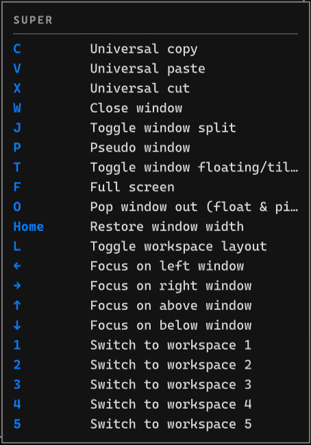

# Omarchy Which Key

Omarchy Which Key brings LazyVim's which-key experience to the desktop. It
automatically reads the active Omarchy and Hyprland keybindings and shows a
compact guide at the bottom right of the focused display when you hold Super.



## Requirements

Omarchy 4 with its Quickshell desktop and Hyprland Lua configuration support.

## Install

Add and enable the plugin with Omarchy:

```bash
omarchy plugin add https://github.com/huacnlee/omarchy-which-key.git --enable
```

Open the Which Key bar widget settings and turn on **Enabled**. The plugin
configures its keyboard integration automatically.

## How it works

The plugin reads Hyprland's active keyboard model, layout, variant, and XKB
options, so remaps such as `altwin:swap_alt_win` still trigger the logical Super
modifier. It observes modifier state without registering a new shortcut. The
overlay then runs `hyprctl binds` each time Super is held and
filters those live results for the active modifier combination. It contains no built-in shortcut
information, so reloaded system changes appear on next use.
The full-screen layer has an empty input region and requests no keyboard focus.

## Usage

Hold a key mapped to Super for at least 200 ms. While it remains held, add Shift,
Ctrl, or Alt to switch to that exact modifier combination. The compact guide
shows at most twenty results in one column. Release Super to close immediately.
A quick Super tap does not open the guide.

## Uninstall

Turn off **Enabled** in the Which Key bar widget settings, then remove the
plugin with Omarchy:

```bash
omarchy plugin remove huacnlee.which-key
```

Disabling removes the plugin's keyboard integration. Other bindings and files
are left untouched.

## Troubleshooting

If nothing appears, check `hyprctl configerrors` and confirm the plugin is
enabled with:

```bash
omarchy plugin list --json | jq '.[] | select(.id == "huacnlee.which-key")'
```

Bindings without a Hyprland description are intentionally omitted. If the
keyboard layout or XKB options change, turn **Enabled** off and on again in the
Which Key settings.
